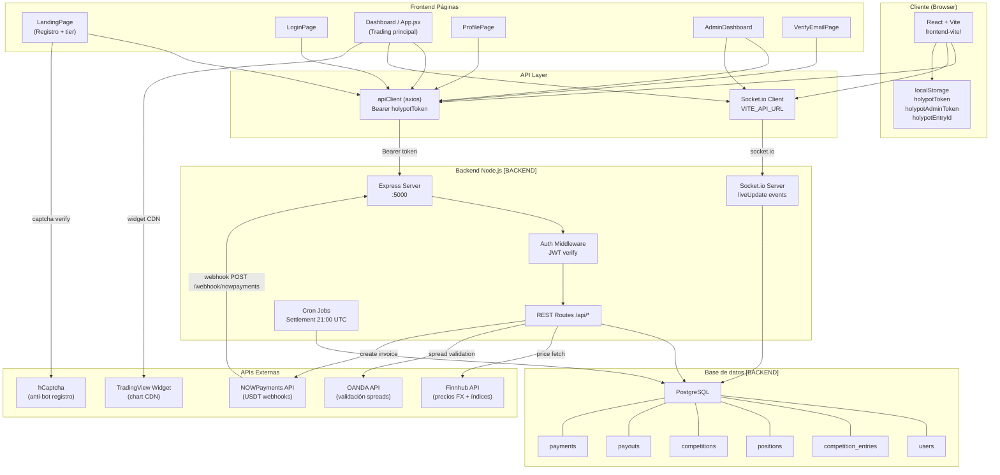

# Holypot Trading – Arquitectura General

> **Nota:** Las secciones marcadas con `[BACKEND]` deben completarse con información del chat de backend.

---

## Stack Tecnológico

| Capa | Tecnología |
|------|-----------|
| Frontend | React 18 + Vite, Tailwind CSS, shadcn/ui, socket.io-client |
| Backend | Node.js + Express `[BACKEND]` |
| Base de datos | PostgreSQL `[BACKEND]` |
| Pagos | NOWPayments (USDT on-chain) |
| Precios FX/Índices | Finnhub `[BACKEND]` |
| Simulación trading | OANDA `[BACKEND]` |
| Captcha | hCaptcha |
| Hosting | Render (frontend + backend) |

---

## Diagrama de Arquitectura



---

## Descripción de Capas

### Frontend (`frontend-vite/src/`)

```
src/
├── main.jsx              # React Router v6 + rutas
├── App.jsx               # Dashboard principal (trading)
├── api.js                # axios instance + interceptor Bearer token
├── pages/
│   ├── LandingPage.jsx   # Registro + selección tier + hCaptcha
│   ├── LoginPage.jsx     # Login usuario
│   ├── AdminLogin.jsx    # Login administrador
│   ├── AdminDashboard.jsx# Panel admin (stats, usuarios, payouts)
│   ├── Profile.jsx       # Perfil + estadísticas usuario
│   ├── VerifyEmailPage.jsx
│   ├── RulesPage.jsx
│   ├── TermsPage.jsx
│   └── PrivacyPage.jsx
└── components/
    ├── PrivateRoute.jsx         # Guarda rutas con holypotToken
    ├── EditPositionModal.jsx    # Editor avanzado TP/SL + chart
    ├── TradingViewChart.jsx     # Widget TradingView (CDN)
    ├── CompetitionEndModal.jsx  # Resultados fin de día
    ├── LandingHeaderWinners.jsx # Últimos ganadores en vivo
    ├── TopWinnersPyramid.jsx    # Podio visual
    ├── Header.jsx               # Header con polling payouts
    ├── useRiskCalculator.js     # Hook cálculo riesgo/lotaje
    ├── pipConfig.js             # Config por instrumento
    └── ui/                      # shadcn/ui components
```

### Autenticación

```
localStorage:
  holypotToken      → JWT del usuario activo (o temporal de admin impersonando)
  holypotAdminToken → JWT del admin guardado mientras impersona usuario
  holypotEntryId    → UUID del entry de competencia activo

Flujo de protección de rutas:
  PrivateRoute → comprueba holypotToken presente → si no, redirige /login
```

### API Client (`src/api.js`)

```javascript
// Base URL dinámica
const API_BASE = VITE_API_URL
  ? `${VITE_API_URL}/api`
  : 'http://localhost:5000/api'

// Interceptor: añade Authorization: Bearer <holypotToken> en cada request
```

### WebSocket (`socket.io-client`)

Conecta a `VITE_API_URL` al montar Dashboard y AdminDashboard.

| Evento | Dirección | Payload |
|--------|-----------|---------|
| `liveUpdate` | Server → Client | posiciones abiertas, capital live, precios en vivo |
| `tradeClosedAuto` | Server → Client | `{ reason: 'TP_hit' \| 'SL_hit', position }` |

---

## Rutas Definidas

| Ruta | Componente | Pública |
|------|-----------|---------|
| `/` | LandingPage | ✅ |
| `/login` | LoginPage | ✅ |
| `/verify-email` | VerifyEmailPage | ✅ |
| `/terms` | TermsPage | ✅ |
| `/privacy` | PrivacyPage | ✅ |
| `/rules` | RulesPage | ✅ |
| `/dashboard` | App.jsx | 🔒 PrivateRoute |
| `/profile` | Profile | 🔒 PrivateRoute |
| `/admin-login` | AdminLogin | ✅ |
| `/admin` | AdminDashboard | 🔒 (token) |

---

## Instrumentos de Trading

| Símbolo | Tipo | pipValue | pipMultiplier |
|---------|------|----------|---------------|
| EURUSD | FX | $10 | 10,000 |
| GBPUSD | FX | $10 | 10,000 |
| USDJPY | FX | $9.09 | 100 |
| XAUUSD | Commodities | $10 | 10 |
| SPX500 | Index | $50 | 1 |
| NAS100 | Index | $20 | 1 |

## Tiers de Competencia

| Tier | Fee USDT | Capital Virtual | Distribución Premio |
|------|----------|-----------------|---------------------|
| Basic | $12 | $10,000 | 50% / 30% / 20% |
| Medium | $59 | $50,000 | 50% / 30% / 20% |
| Premium | $107 | $100,000 | 50% / 30% / 20% |
