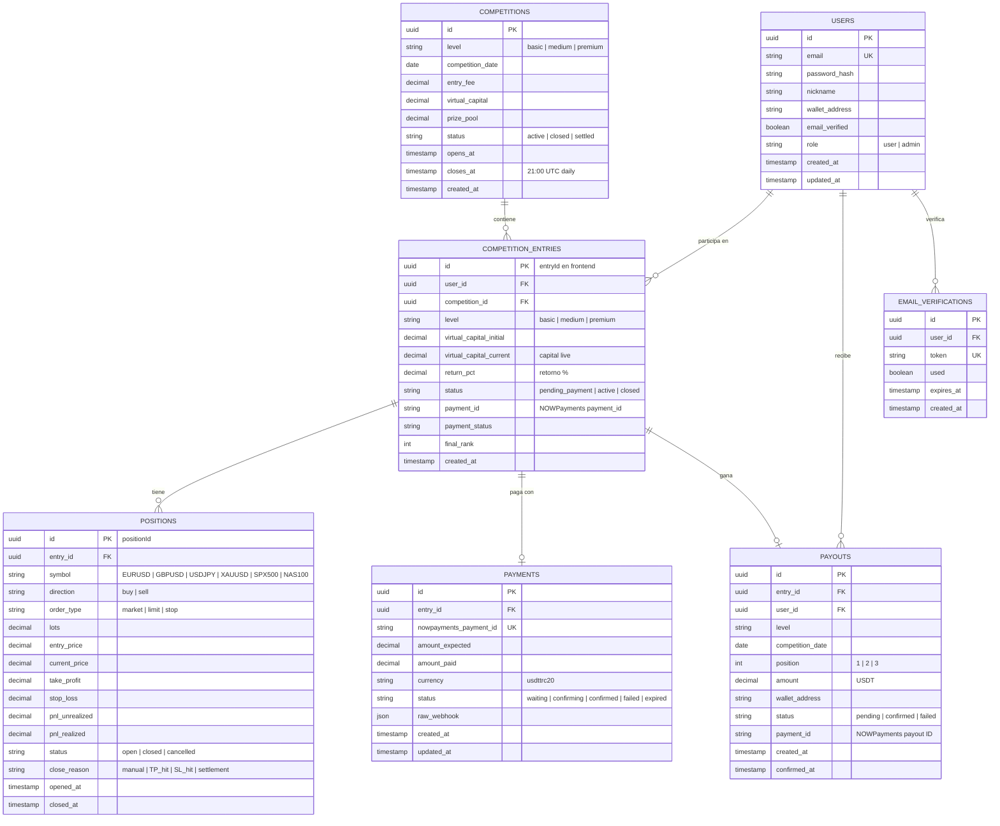

# Holypot Trading – Esquema de Base de Datos

> **Nota:** Este esquema está inferido desde los datos que consume el frontend (campos visibles en respuestas API).
> Las secciones marcadas con `[BACKEND]` deben completarse/corregirse con el esquema real del backend.

---

## Diagrama ER



---

## Descripción de Tablas

### `users`
Usuarios registrados en la plataforma.

| Campo | Tipo | Notas |
|-------|------|-------|
| `id` | UUID | PK, generado automáticamente |
| `email` | VARCHAR | Único, requerido para login |
| `password_hash` | VARCHAR | bcrypt `[BACKEND]` |
| `nickname` | VARCHAR | Nombre público en rankings |
| `wallet_address` | VARCHAR | Wallet USDT para recibir premios |
| `email_verified` | BOOLEAN | False hasta que clic en email |
| `role` | ENUM | `user` o `admin` |

---

### `competitions`
Competencias diarias por nivel.

| Campo | Tipo | Notas |
|-------|------|-------|
| `level` | ENUM | `basic`, `medium`, `premium` |
| `prize_pool` | DECIMAL | Suma de fees - comisión plataforma |
| `closes_at` | TIMESTAMP | 21:00 UTC cada día |
| `status` | ENUM | `active` → `closed` → `settled` |

> Cada día hay hasta 3 competencias activas (una por nivel).

---

### `competition_entries`
Inscripción de un usuario a una competencia. Es el `entryId` usado en todo el frontend.

| Campo | Tipo | Notas |
|-------|------|-------|
| `id` | UUID | Es el `holypotEntryId` guardado en localStorage |
| `virtual_capital_current` | DECIMAL | Capital "live" — varía con P&L de posiciones |
| `return_pct` | DECIMAL | `(capital_current - capital_initial) / capital_initial * 100` |
| `final_rank` | INT | Seteado al settlement (1, 2, 3...) |
| `status` | ENUM | `pending_payment` → `active` → `closed` |

---

### `positions`
Trades abiertos y cerrados de cada entry.

| Campo | Tipo | Notas |
|-------|------|-------|
| `symbol` | VARCHAR | Uno de los 6 instrumentos |
| `direction` | ENUM | `buy` o `sell` |
| `order_type` | ENUM | `market`, `limit`, `stop` |
| `lots` | DECIMAL | Tamaño del contrato |
| `close_reason` | ENUM | `manual`, `TP_hit`, `SL_hit`, `settlement` |

> El P&L se calcula como: `(currentPrice - entryPrice) × direction × lots × pipValue / pipMultiplier`

---

### `payouts`
Registro de premios pagados a los top 3 de cada competencia.

| Campo | Tipo | Notas |
|-------|------|-------|
| `position` | INT | 1 (50%), 2 (30%), 3 (20%) |
| `amount` | DECIMAL | Monto en USDT |
| `wallet_address` | VARCHAR | Copiado de users.wallet_address |
| `status` | ENUM | `pending` → `confirmed` |
| `payment_id` | VARCHAR | ID de payout en NOWPayments `[BACKEND]` |

---

### `payments`
Registro del pago de fee de entrada via NOWPayments.

| Campo | Tipo | Notas |
|-------|------|-------|
| `nowpayments_payment_id` | VARCHAR | ID externo de NOWPayments |
| `amount_expected` | DECIMAL | $12, $59 o $107 |
| `amount_paid` | DECIMAL | Lo que realmente llegó |
| `raw_webhook` | JSON | Payload completo del webhook guardado |

---

## Datos Visibles en el Frontend (inferidos de respuestas API)

### GET /admin/data → `data.usuarios[]`
```json
{
  "id": "uuid (entryId)",
  "displayName": "nickname",
  "wallet": "0x...",
  "level": "basic",
  "status": "active",
  "virtualCapital": 10250.50
}
```

### GET /admin/data → `data.competencias[level].ranking[]`
```json
{
  "displayName": "trader123",
  "wallet": "0x...",
  "retorno": "+12.5%",
  "liveCapital": 11250.00
}
```

### GET /my-positions → posiciones activas
```json
{
  "id": "uuid",
  "symbol": "EURUSD",
  "direction": "buy",
  "lots": 0.5,
  "entryPrice": 1.0850,
  "currentPrice": 1.0870,
  "tp": 1.0900,
  "sl": 1.0800,
  "pnl": 100.00
}
```

### GET /admin/payouts → historial payouts
```json
{
  "id": "uuid",
  "date": "2026-02-15T21:00:00Z",
  "user": { "nickname": "trader123" },
  "level": "premium",
  "position": 1,
  "amount": 535.00,
  "status": "confirmed",
  "paymentId": "np_..."
}
```

---

## Índices Recomendados `[BACKEND: verificar]`

```sql
-- Acceso frecuente: posiciones por entry
CREATE INDEX idx_positions_entry_id ON positions(entry_id);
CREATE INDEX idx_positions_status ON positions(status);

-- Rankings por competencia y nivel
CREATE INDEX idx_entries_competition_level ON competition_entries(competition_id, level);
CREATE INDEX idx_entries_return_pct ON competition_entries(return_pct DESC);

-- Pagos pendientes
CREATE INDEX idx_payouts_status ON payouts(status);
CREATE INDEX idx_payments_nowpayments_id ON payments(nowpayments_payment_id);
```
