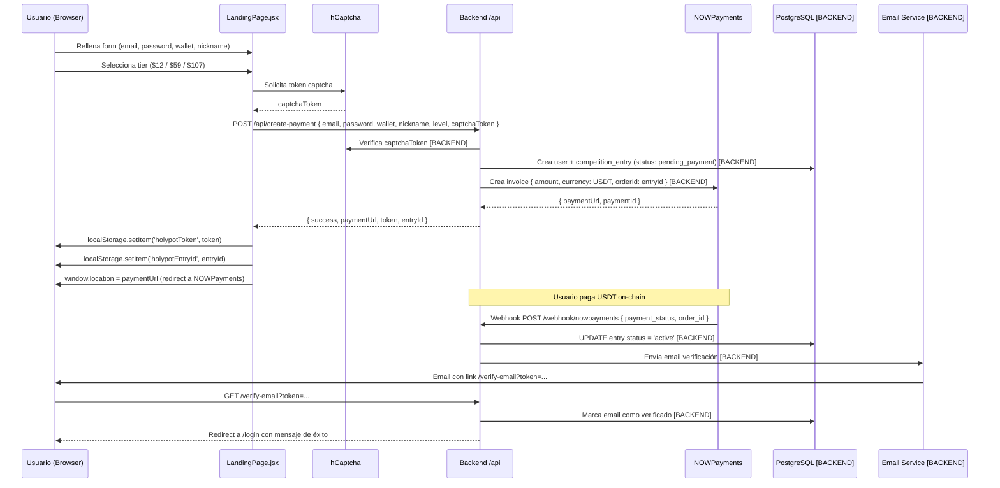
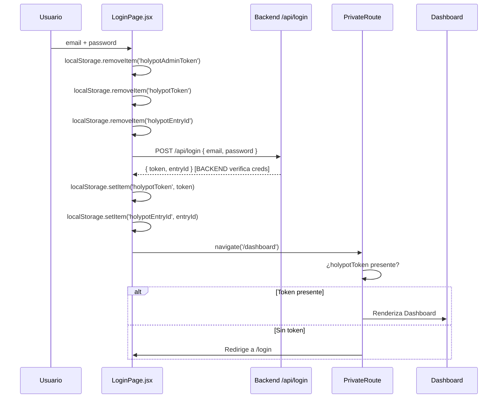
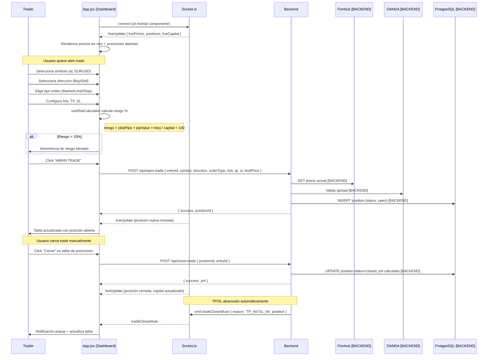
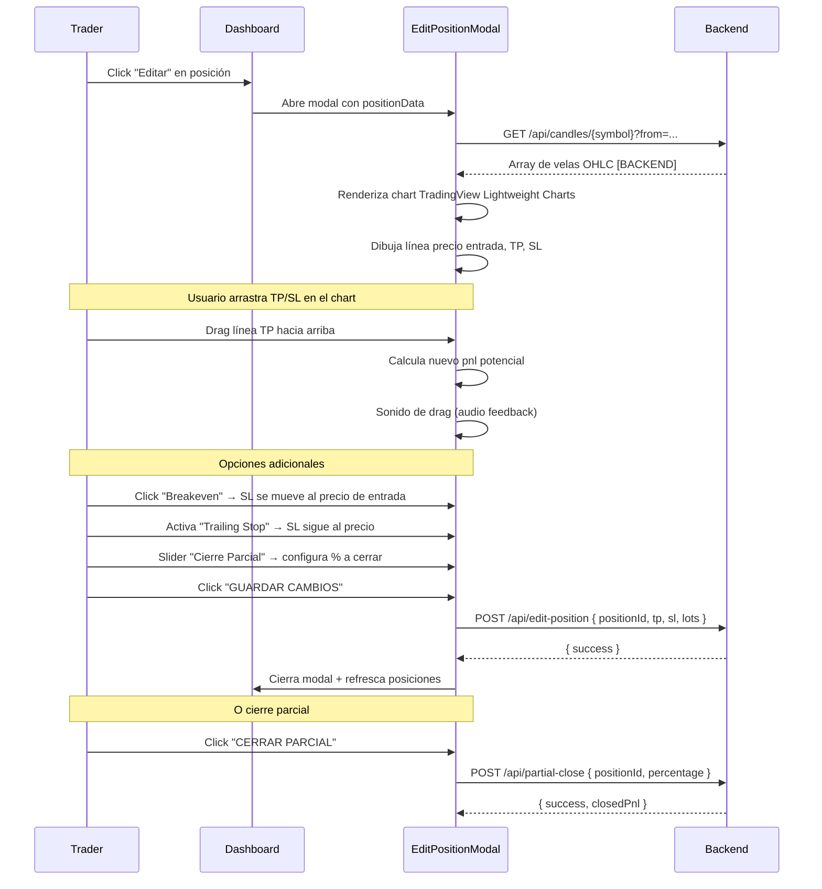
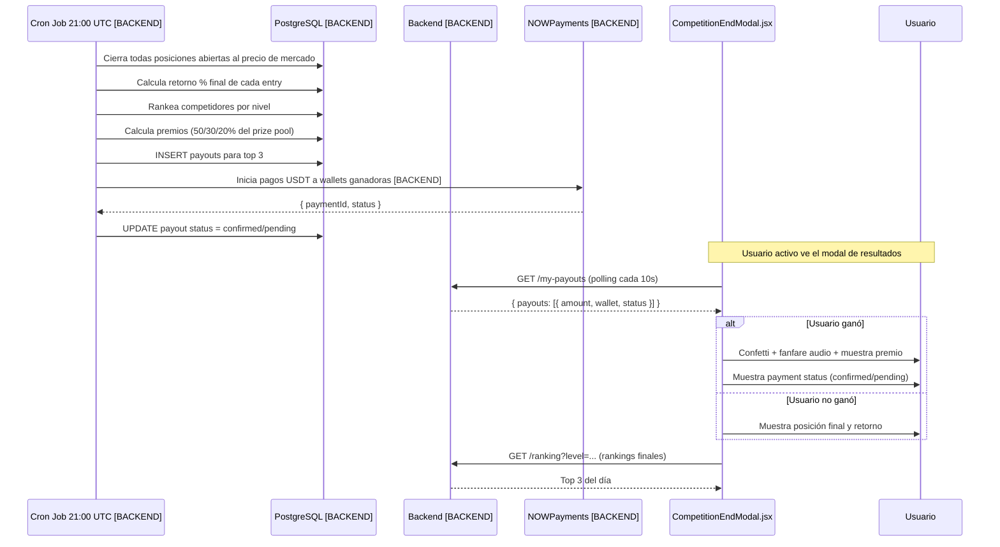
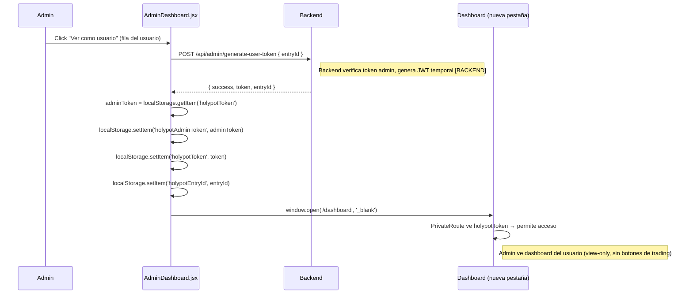
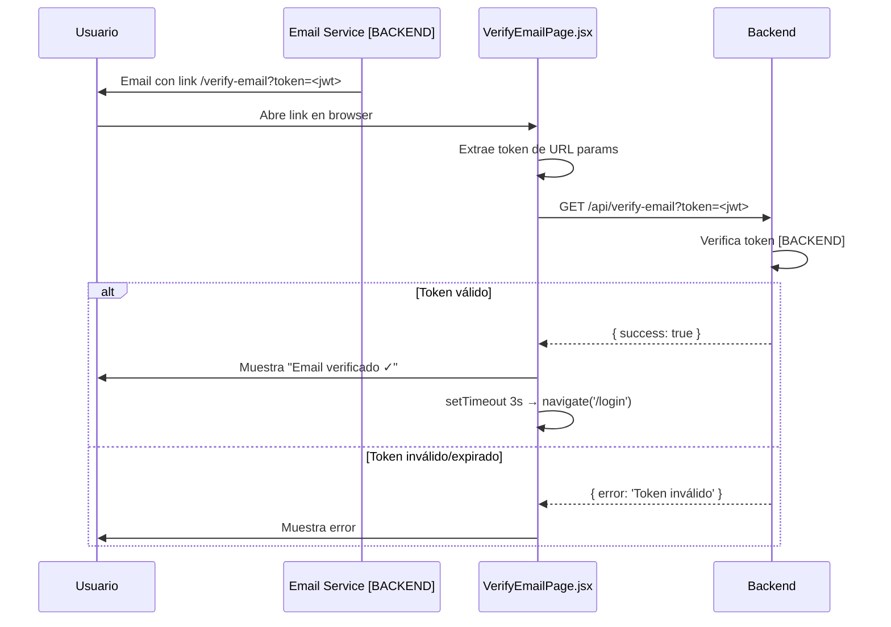

# Holypot Trading – Flujos de la Plataforma

> **Nota:** Las secciones marcadas con `[BACKEND]` deben completarse con información del chat de backend.

---

## 1. Registro de Usuario y Selección de Tier

---

## 2. Login y Protección de Rutas

---

## 3. Apertura y Gestión de Trades (Flujo Principal)

---

## 4. Edición de Posición (Modal Avanzado)

---

## 5. Settlement Diario y Payout

---

## 6. Impersonación de Usuario por Admin

---

## 7. Verificación de Email

