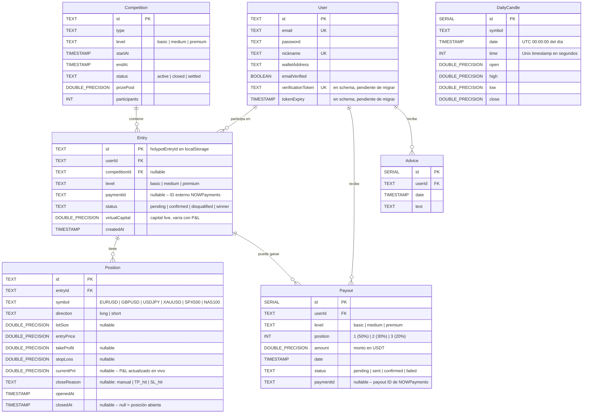

# Holypot Trading – Esquema de Base de Datos

> **ORM:** Prisma
> **Base de datos:** PostgreSQL
> **Archivo fuente:** `prisma/schema.prisma`
> Última revisión contra el backend real: 2026-02-15

---

## Diagrama ER



---

## Descripción de Tablas

### `User`

| Campo | Tipo Prisma | Tipo SQL | Notas |
|-------|-------------|----------|-------|
| `id` | `String @default(cuid())` | TEXT | PK, generado con cuid() |
| `email` | `String @unique` | TEXT | Único, requerido |
| `password` | `String?` | TEXT | bcrypt, **10 salt rounds** |
| `nickname` | `String? @unique` | TEXT | Único, nullable |
| `walletAddress` | `String?` | TEXT | Wallet USDT para premios, nullable |
| `emailVerified` | `Boolean @default(false)` | BOOLEAN | False hasta verificar email |
| `verificationToken` | `String? @unique` | TEXT | **En schema.prisma pero SIN migración aplicada** |
| `tokenExpiry` | `DateTime?` | TIMESTAMP(3) | **En schema.prisma pero SIN migración aplicada** |

> **IMPORTANTE:** `verificationToken` y `tokenExpiry` están definidos en `schema.prisma` pero no existe migration para ellos aún. No están en la base de datos actualmente.

> **NO existe** tabla separada `email_verifications` – el token se guarda directamente en `User`.

---

### `Competition`

| Campo | Tipo SQL | Notas |
|-------|----------|-------|
| `id` | TEXT | PK |
| `type` | TEXT | |
| `level` | TEXT | `basic`, `medium`, `premium` |
| `startAt` | TIMESTAMP(3) | |
| `endAt` | TIMESTAMP(3) | 21:00 UTC diariamente |
| `status` | TEXT DEFAULT `'active'` | `active` → `closed` → `settled` |
| `prizePool` | DOUBLE PRECISION DEFAULT `0.0` | |
| `participants` | INTEGER DEFAULT `0` | |

---

### `Entry`

Es el `holypotEntryId` usado en todo el frontend (guardado en `localStorage`).

| Campo | Tipo SQL | Notas |
|-------|----------|-------|
| `id` | TEXT | PK – es el `holypotEntryId` |
| `userId` | TEXT | FK → `User.id` |
| `competitionId` | TEXT nullable | FK → `Competition.id` (nullable) |
| `level` | TEXT | `basic`, `medium`, `premium` |
| `paymentId` | TEXT nullable | ID externo de NOWPayments |
| `status` | TEXT DEFAULT `'pending'` | Ver estados abajo |
| `virtualCapital` | DOUBLE PRECISION DEFAULT `0.0` | Capital live – se actualiza con P&L |
| `createdAt` | TIMESTAMP(3) | |

**Estados de Entry:**

| Estado | Descripción |
|--------|-------------|
| `pending` | Creada, esperando pago |
| `confirmed` | Pago confirmado, competencia activa |
| `disqualified` | Descalificada |
| `winner` | Ganador confirmado al settlement |

> **Diferencia con docs de frontend:** Los estados reales son `pending / confirmed / disqualified / winner`, NO `pending_payment / active / closed`.

> **NO existe** campo `return_pct`, `virtual_capital_initial` ni `final_rank` en `Entry` – estos se calculan en el backend al vuelo.

> **NO existe** tabla separada `payments` – el `paymentId` de NOWPayments se almacena directamente en `Entry`.

---

### `Position`

| Campo | Tipo SQL | Notas |
|-------|----------|-------|
| `id` | TEXT | PK |
| `entryId` | TEXT | FK → `Entry.id` |
| `symbol` | TEXT | `EURUSD`, `GBPUSD`, `USDJPY`, `XAUUSD`, `SPX500`, `NAS100` |
| `direction` | TEXT | **`long`** o **`short`** (NO `buy`/`sell`) |
| `lotSize` | DOUBLE PRECISION nullable | Tamaño en lotes |
| `entryPrice` | DOUBLE PRECISION | Precio de apertura |
| `takeProfit` | DOUBLE PRECISION nullable | |
| `stopLoss` | DOUBLE PRECISION nullable | |
| `currentPnl` | DOUBLE PRECISION nullable | P&L calculado en vivo por el backend |
| `closeReason` | TEXT nullable | `manual`, `TP_hit`, `SL_hit` |
| `openedAt` | TIMESTAMP(3) | |
| `closedAt` | TIMESTAMP(3) nullable | `null` = posición abierta |

> **Diferencias con docs de frontend:**
> - `direction`: `long`/`short` (no `buy`/`sell`)
> - **No existe** campo `order_type` – no hay órdenes limit ni stop
> - **No existe** campo `status` – estado inferido: `closedAt IS NULL` → abierta, si tiene valor → cerrada
> - **No existe** `pnl_unrealized`/`pnl_realized` por separado – solo `currentPnl`
> - **No existe** `current_price` almacenado en DB – viene del cache de precios en memoria

---

### `Payout`

| Campo | Tipo SQL | Notas |
|-------|----------|-------|
| `id` | SERIAL | PK autoincremental |
| `userId` | TEXT | FK → `User.id` |
| `level` | TEXT | `basic`, `medium`, `premium` |
| `position` | INTEGER | `1` (50%), `2` (30%), `3` (20%) |
| `amount` | DOUBLE PRECISION | Monto en USDT |
| `date` | TIMESTAMP(3) DEFAULT `now()` | |
| `status` | TEXT DEFAULT `'pending'` | `pending`, `sent`, `confirmed`, `failed` |
| `paymentId` | TEXT nullable | ID del payout en NOWPayments |

> **Diferencia:** El payout status es `sent` (no `confirming`) antes de `confirmed`.

---

### `Advice`

Tabla de consejos/notas por usuario. **No estaba en los docs del frontend.**

| Campo | Tipo SQL | Notas |
|-------|----------|-------|
| `id` | SERIAL | PK autoincremental |
| `userId` | TEXT | FK → `User.id` |
| `date` | TIMESTAMP(3) DEFAULT `now()` | |
| `text` | TEXT | Contenido del consejo |

**Índice:** `Advice_userId_idx ON Advice(userId)`

---

### `DailyCandle`

Velas OHLC diarias por símbolo, construidas desde los precios de Finnhub en tiempo real. **No estaba en los docs del frontend.**

| Campo | Tipo SQL | Notas |
|-------|----------|-------|
| `id` | SERIAL | PK autoincremental |
| `symbol` | TEXT | `EURUSD`, `GBPUSD`, etc. |
| `date` | TIMESTAMP(3) | Fecha del día (UTC 00:00:00) |
| `time` | INTEGER | Unix timestamp en segundos |
| `open` | DOUBLE PRECISION | |
| `high` | DOUBLE PRECISION | |
| `low` | DOUBLE PRECISION | |
| `close` | DOUBLE PRECISION | |

**Índices:**
```sql
UNIQUE INDEX DailyCandle_symbol_date_time_key ON DailyCandle(symbol, date, time);
INDEX DailyCandle_symbol_date_idx ON DailyCandle(symbol, date);
```

> Estas son las velas que sirve el endpoint `/api/candles/{symbol}` que consume `EditPositionModal`.
> **OANDA no se usa como API** – los datos son 100% de Finnhub.

---

## Tablas que NO existen en el backend real

Estas tablas estaban inferidas en los docs del frontend pero **no existen**:

| Tabla inferida | Realidad |
|---------------|---------|
| `payments` | No existe. El `paymentId` y estado de pago van en `Entry.paymentId` y `Entry.status` |
| `email_verifications` | No existe como tabla. Los campos `verificationToken`/`tokenExpiry` van en `User` (y aún sin migrar) |

---

## Índices existentes (reales)

```sql
-- User
UNIQUE INDEX "User_email_key" ON "User"("email");
UNIQUE INDEX "User_nickname_key" ON "User"("nickname");

-- Advice
INDEX "Advice_userId_idx" ON "Advice"("userId");

-- Payout
INDEX "Payout_userId_idx" ON "Payout"("userId");

-- DailyCandle
UNIQUE INDEX "DailyCandle_symbol_date_time_key" ON "DailyCandle"("symbol", "date", "time");
INDEX "DailyCandle_symbol_date_idx" ON "DailyCandle"("symbol", "date");
```

> **Índices recomendados aún no creados** (sería útil añadirlos):
> ```sql
> -- Posiciones abiertas por entry (consulta frecuente)
> CREATE INDEX "Position_entryId_idx" ON "Position"("entryId");
> CREATE INDEX "Position_closedAt_idx" ON "Position"("closedAt") WHERE "closedAt" IS NULL;
> -- Entries por usuario
> CREATE INDEX "Entry_userId_idx" ON "Entry"("userId");
> -- Entries activas por competencia y nivel
> CREATE INDEX "Entry_competitionId_level_idx" ON "Entry"("competitionId", "level");
> ```

---

## Datos Visibles en el Frontend (respuestas API reales)

### GET /admin/data → `data.usuarios[]`
```json
{
  "id": "uuid (entryId)",
  "displayName": "nickname",
  "wallet": "0x...",
  "level": "basic",
  "status": "confirmed",
  "virtualCapital": 10250.50
}
```

### GET /my-positions → posiciones activas
```json
{
  "id": "uuid",
  "symbol": "EURUSD",
  "direction": "long",
  "lotSize": 0.5,
  "entryPrice": 1.0850,
  "takeProfit": 1.0900,
  "stopLoss": 1.0800,
  "currentPnl": 100.00,
  "openedAt": "2026-02-15T18:00:00.000Z"
}
```

> Nota: `currentPrice` y `return_pct` se calculan en el backend al armar la respuesta; no se persisten en DB.
